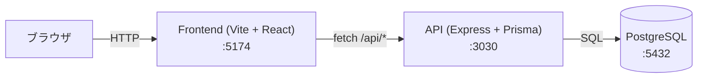
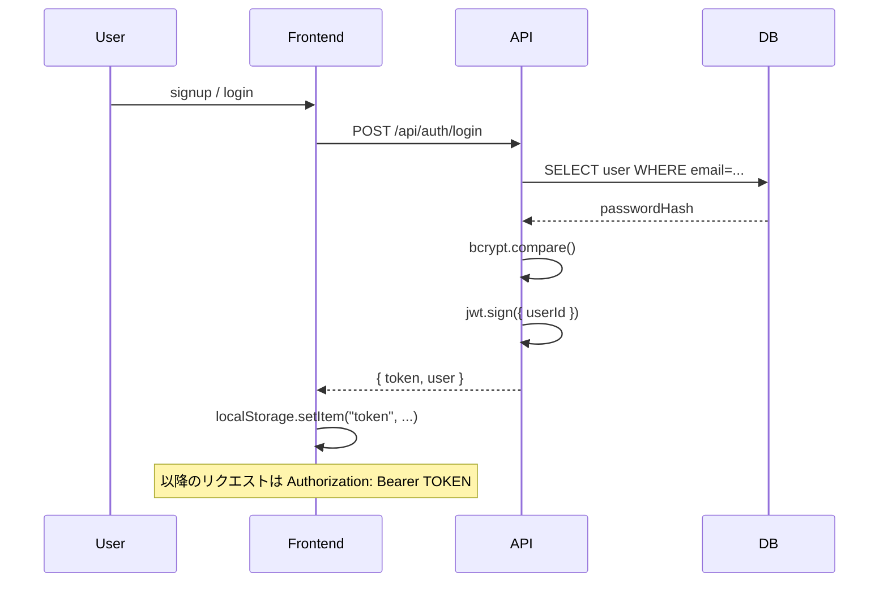
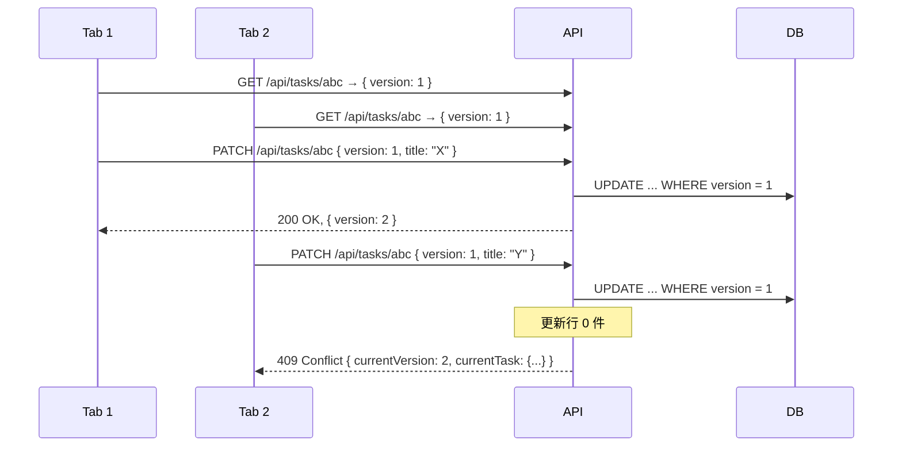

# アーキテクチャ

LuaGate 実践開発プロジェクト② タスク管理アプリの全体構成。

## 全体構成図



開発時は Vite の dev proxy が `/api/*` を API に転送するため、ブラウザから直接 API を叩くことはありません。本番では `VITE_API_BASE_URL` で API のフル URL を指定します。

## 認証フロー (JWT)



- `POST /api/auth/signup` — メール + パスワードで登録。`bcrypt` でハッシュ化して保存
- `POST /api/auth/login` — メール + パスワードで認証。成功時に JWT を発行
- JWT は `Authorization: Bearer TOKEN` ヘッダで送信
- API 側は `requireAuth` ミドルウェアで JWT を検証し、`req.userId` を埋める

## データモデル

```
User 1 ──< Task
```

シンプルなフラット構造。ユーザーがタスクを直接所有します。

### User
- `id` (cuid)
- `email` (unique)
- `passwordHash` (bcrypt)
- `displayName`
- `createdAt` / `updatedAt`

### Task
- `id` (cuid)
- `userId` (FK)
- `title`
- `description` (nullable)
- `status` — `"not_started"` / `"in_progress"` / `"completed"`
- `priority` — `"low"` / `"medium"` / `"high"`
- `dueDate` (nullable)
- `version` — **楽観ロック用**
- `createdAt` / `updatedAt`

## 楽観ロック (Optimistic Locking)

複数タブで同じタスクを同時編集した時の衝突を検知するため、`version` カラムを使った楽観ロックを採用しています。



クライアントは 409 を受けたら最新タスクで再描画 → ユーザーに再編集を促します。

## ディレクトリ詳細

### api/

```
api/
├─ src/
│  ├─ index.ts            # Express セットアップ
│  ├─ db/                 # Prisma クライアント
│  ├─ middleware/         # requireAuth (JWT 検証)
│  ├─ routes/
│  │  ├─ auth.ts          # signup / login
│  │  ├─ me.ts            # 自分の情報
│  │  └─ tasks.ts         # タスク CRUD + 楽観ロック
│  └─ utils/              # jwt / password / errors
├─ prisma/
│  ├─ schema.prisma
│  └─ seed.ts             # デモアカウント投入
└─ Dockerfile             # Cloud Run 用
```

### frontend/

```
frontend/
├─ src/
│  ├─ pages/
│  │  ├─ Login.tsx        # Figma node-id 948-1147
│  │  ├─ Signup.tsx       # Figma node-id 948-1227
│  │  └─ Tasks.tsx        # Figma node-id 948-1352
│  ├─ components/         # TaskCard / TaskFormModal / TaskDetailModal / ...
│  ├─ api/                # fetch ラッパ + 型定義
│  ├─ hooks/              # useAuth / useTasks
│  └─ App.tsx
└─ Dockerfile             # Cloud Run 用
```

## デプロイ

両サービスとも Cloud Run へ Docker でデプロイする想定です。詳細は各 `Dockerfile` および ルート `README.md` を参照。
